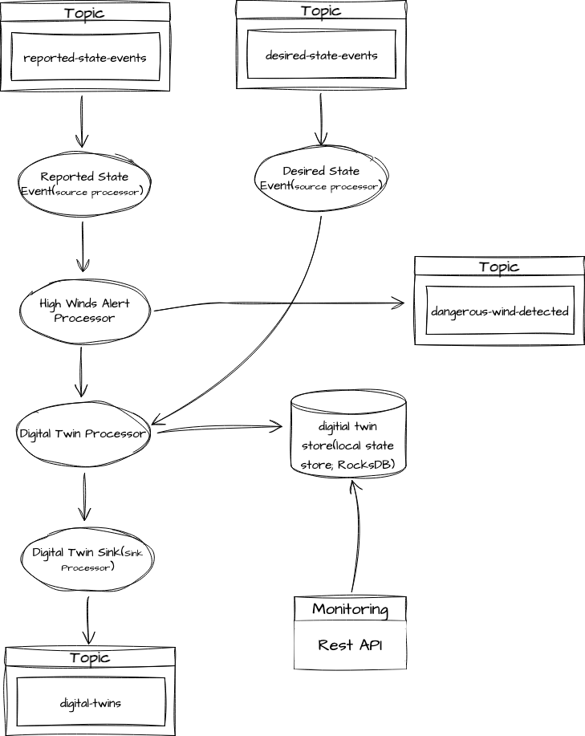

## 프로젝트 
- 풍력 측정도구에 대한 디지털 트윈 서비스 구축 프로젝트

## 아키텍처
  - 
## flow
1. **풍력 측정도구에서 발생한 데이터** -> `reported-state-events` 토픽에 저장
2. **HighWindsAlertProcessor**에서 `reported-state-events` 토픽을 지속적으로 모니터링하여 바람 상태가 위험하면 위험신호를 `dangerous-wind-detected`로 전송
3. **HighWindsAlertProcessor**에서 바람 상태가 정상인 경우 데이터를 **DigitalTwinProcessor**로 전달
4. **DigitalTwinProcessor**에서 추가적인 처리 후 `digital-twins`로 데이터를 전송
   - `desired-state-events` 토픽에 직접 생성한 신호와 풍력 측정 도구에서 수집한 데이터를 합치는 작업을 수행하는 프로세서
   - 이 프로세서에서 kvStore(rocksDB)를 사용해 데이터를 합치는 처리를 수행함
   - punctuator(scheduler)를 활용해 kvStore에 저장된 데이터 중에서 7일 이상 지난 데이터를 삭제

## 실행 방법 
  - docker-compose로 kafka 클러스터 실행
    ```sh
    cd /docker
    docker-compose up -d
    ```
  - kafka 모니터링
    - 참조) https://github.com/provectus/kafka-ui
    - http://localhost:8989
  - 생성해야 하는 Topic 정보
    ```sh
    // reported-state-events토픽 생성
    docker-compose exec kafka-1 bash -c "
    /bin/kafka-topics --bootstrap-server localhost:9092 \
    --topic reported-state-events \
    --replication-factor 1 \
    --partitions 4 \
    --create"
    
    // desired-state-events토픽 생성 
    docker-compose exec kafka-1 bash -c "
    /bin/kafka-topics --bootstrap-server localhost:9092 \
    --topic reported-state-events \
    --replication-factor 1 \
    --partitions 4 \
    --create"
    
    // digital-twins토픽 생성
    docker-compose exec kafka-1 bash -c "
    /bin/kafka-topics --bootstrap-server localhost:9092 \
    --topic digital-twins \
    --replication-factor 1 \
    --partitions 4 \
    --create"

    // dangerous-wind-detected토픽 생성
    docker-compose exec kafka-1 bash -c "
    /bin/kafka-topics --bootstrap-server localhost:9092 \
    --topic dangerous-wind-detected \
    --replication-factor 1 \
    --partitions 4 \
    --create"    

    
   - desired-state-events토픽에 생성한 record(key|value)
     - 1|{"timestamp": "2020-11-23T09:12:00.000Z", "power": "ON", "type": "DESIRED"}

   - reported-state-event토픽에 생성한 record(key|value)
     - 1|{"timestamp": "2020-11-23T09:02:00.000Z", "wind_speed_mph": 40, "power": "ON", "type": "REPORTED"}
     - 1|{"timestamp": "2020-11-23T09:02:00.500Z", "wind_speed_mph": 42, "power": "ON", "type": "REPORTED"}
     - 1|{"timestamp": "2020-11-23T09:02:01.000Z", "wind_speed_mph": 44, "power": "ON", "type": "REPORTED"}
     - 1|{"timestamp": "2020-11-23T09:02:01.000Z", "wind_speed_mph": 68, "power": "ON", "type": "REPORTED"}

  