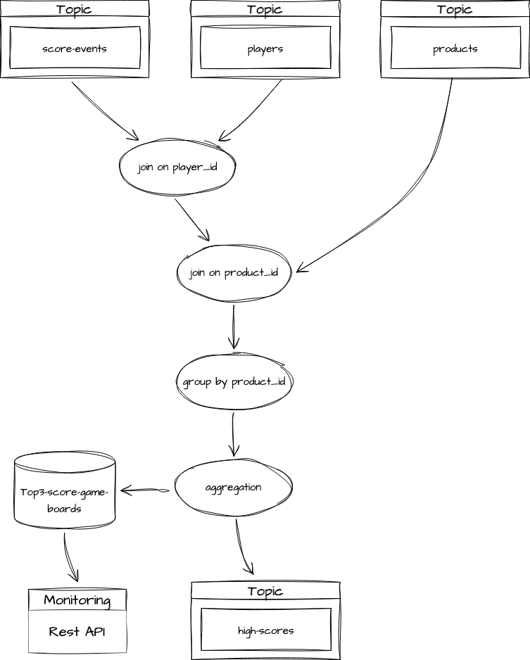

## 프로젝트 
- 게임별 가장 높은 점수를 받은 3명의 user를 출력하는 스트림 프로젝트

## 아키텍처
  - 
## flow
1. **score-events토픽, players토픽, products토픽으로부터 이벤트 컨슈밍**
2. **score-events토픽으로부터 가져온 이벤트와 players토픽으로부터 가져온 이벤트를 join**
3. **withPlayer스트림으로부터 가져온 이벤트와 products토픽으로부터 가져온 이벤트를 join**
4. **최종 조인된 결과 스트림으로부터 product_id를 기준으로 그룹핑**
5. **그룹핑한 결과 스트림으로부터 집계연산을 수행** -> local state store에 결과 저장
6. **집계 연산 수행후, 결과 레코드를 high-scores토픽으로 전송**
7. **모니터링을 위해 local state store로 api요청 가능**
   - 최종 결과 조회(high-scores토픽에 담긴 정보) [curl -s localhost:7000/game-board | jq '.'](http://)
   - 저장된 user정보 조회: [curl -s localhost:7000/players | jq '.'](http://)

## 실행 방법 
  - kafka-ui
    - http://localhost:8989/ui/clusters/local/all-topics?perPage=25
  - docker-compose로 kafka 클러스터 실행
    ```sh
    cd /docker
    docker-compose up -d
    ```
  - kafka0 컨테이너 접속후, ./docker/data 넣어서 테스트 수행
      1. 컨테이너 내부로 접속
      2. high-scores, players, products, score-events토픽 생성 화인 with partition 3
      3. players토픽에 이벤트 발행
      4. products토픽에 이벤트 발행
      5. score-events토픽에 이벤트 발행
      ```sh
      docker exec -it kafka0 /bin/bash

      kafka-topics --bootstrap-server kafka0:29092 --list
    
      echo "3|{\"id\": 3, \"name\": \"kyuhoon\"}" | kafka-console-producer --broker-list kafka0:29092 --topic players --property "parse.key=true" --property "key.separator=|"
      echo "1|{\"id\": 1, \"name\": \"yoonsik\"}" | kafka-console-producer --broker-list kafka0:29092 --topic players --property "parse.key=true" --property "key.separator=|"
      echo "2|{\"id\": 2, \"name\": \"minjeong\"}" | kafka-console-producer --broker-list kafka0:29092 --topic players --property "parse.key=true" --property "key.separator=|"
      echo "4|{\"id\": 4, \"name\": \"seungjoo\"}" | kafka-console-producer --broker-list kafka0:29092 --topic players --property "parse.key=true" --property "key.separator=|"
 
      echo "1|{\"id\": 1, \"name\": \"BattleGround\"}" | kafka-console-producer --broker-list kafka0:29092 --topic products --property "parse.key=true" --property "key.separator=|"
      echo "6|{\"id\": 6, \"name\": \"Overwatch\"}" | kafka-console-producer --broker-list kafka0:29092 --topic products --property "parse.key=true" --property "key.separator=|"

      kafka-console-producer --broker-list kafka0:29092 --topic score-events
      {"score": 1000, "product_id": 1, "player_id": 1}
      {"score": 2000, "product_id": 1, "player_id": 2}
      {"score": 4000, "product_id": 1, "player_id": 3}
      {"score": 500, "product_id": 1, "player_id": 4}
      {"score": 800, "product_id": 6, "player_id": 1}
      {"score": 2500, "product_id": 6, "player_id": 2}
      {"score": 9000.0, "product_id": 6, "player_id": 3}
      {"score": 1200.0, "product_id": 6, "player_id": 4}

  