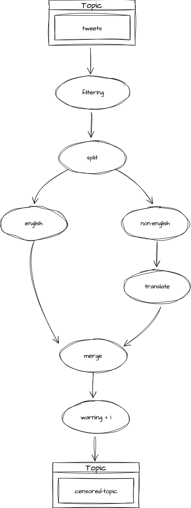

## 프로젝트 
- 트윗터 메시지 필터링 프로젝트
- 비영어 트윗은 영어로 번역(가공처리)
- 부적절한 단어 사용시, warning + 1

## 아키텍처

## flow
1. **tweets 토픽으로부터 데이터 컨슈밍**
2. **filtering: retweet이 아닌 경우만 담기**
3. **split: 영어가 아닌 트윗은 번역을 위해 프로세서를 분기함(branch)**
4. **transform: 영어가 아닌 트윗은 영어로 번역**
5. **merge: 번역한 트윗과 영어 트윗 스트림을 병합**
6. **transform: 부적절한 단어가 존재한다면 경고+1**
7. **censored-topic 토픽으로 프로듀싱**

## Test-data
- com.tweet.data 하위의 test.json 사용

## source
- tweets 토픽으로 들어오는 데이터는 kafka connector사용
